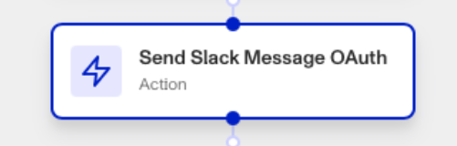

# Workflows: Send Slack Message step

# What is the Send Slack Message action step?

**Send Slack Message OAuth** is a Workflow action step from the Slack integration that sends a message to a Slack workspace’s user.

Slack is a messaging platform and collaboration hub that brings the right people, information, and tools together to get work done. Slack is available as a [Marketplace integration](./6YaRAGHHcXb6MQ0c6CGvbJ.md).

If your organization uses Slack to communicate, Persona’s Slack integration can be useful for automatically notifying and updating your internal teams of relevant workflow events. You can have the Send Slack Message OAuth step send a customized message either to a specific Slack user, or into a Slack channel.

# How do you add a Send Slack Message OAuth action step?

1.  Navigate to the Dashboard, and click on **Workflows** > **All Workflows**.
2.  Find and click on the workflow you want to edit, or **Create** a new workflow.
3.  Click on **+** when hovering over a circle to add an **Action**.

4.  Use the **Find Action** select box to click on **Marketplace** > **Slack** > **Send Slack Message OAuth**.
5.  Set the **Slack workspace** the step should interact with. This workspace must have Persona added to it during the integration process.
6.  Set the **Recipient Type**, either a Slack user or Slack channel.
7.  Set the **Recipient ID** that identifies the Slack user or channel the step will send a message to.
8.  Add the **Message**, either manually or from elsewhere in your workflow with ‘**+**’.
9.  (Optional) In ‘Advanced Configuration’, click the **Continue on error** box if you want the workflow to continue running even if this step raises an error.
10.  **Close** the step. You’ll have to **Save** and **Publish** the workflow to begin using it.

# Plans Explained

## Send Slack Message OAuth by plan

|  | Startup Program | Essential Plan | Growth Plan | Enterprise Plan |
| --- | --- | --- | --- | --- |
| Send Slack Message OAuth action step | Not Available | Not Available | Available | Available |

[Learn more about pricing and plans](./6oZbzp7jb7AWGClF5vpY3K.md).

# Learn more

[Learn more about Slack integration here.](./7FlnOvBKFu6k7sunbzQH0K.md)
