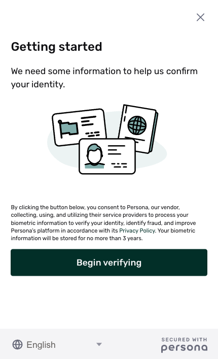
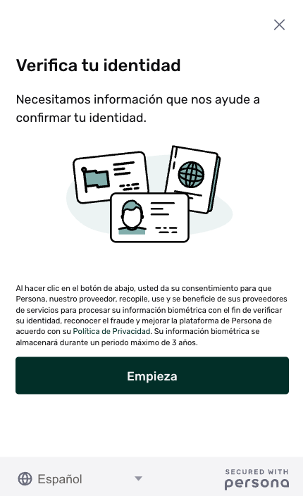

# Translations / Localizations

## Overview

Persona allows you to translate your flow and localize it.

.

## Languages

Supported languages include:

-   Arabic (Egypt)
-   Bengali/Bangla
-   Chinese (Simplified)
-   Chinese (Traditional)
-   Czech
-   Danish
-   Dutch (Netherlands)
-   English (US)
-   Finnish
-   French
-   German
-   Greek
-   Hebrew
-   Hindi
-   Hindi
-   Hungarian
-   Indonesian (Bahasa)
-   Italian
-   Japanese
-   Korean
-   Lithuanian
-   Malay
-   Norwegian
-   Polish
-   Portuguese (Brazil)
-   Romanian
-   Russian
-   Slovak
-   Spanish (Mexico)
-   Swedish
-   Tamil
-   Thai
-   Turkish
-   Turkish
-   Ukrainian
-   Urdu
-   Vietnamese
-   Welsh

## Behavior

When an end user opens the flow, Persona sets the language of the flow to the user's default:

-   If a user opens the flow on a web browser, Persona sets the language to the default browser language.
-   If a user opens the flow on a mobile app, Persona sets the language to the default mobile device language.

The user can optionally change the language via a select component in the flow.

## Translations

Persona provides default translations for the default text in each step of an Inquiry. You can edit these translations using the [Flow Editor](./ETA0GIS8K60DSoiFRpA9z.md).

### Use cases

There are several reasons you may want to edit a translation, which include:

-   **Tone and style**: You may edit a default translation to match your preferred tone and style in a given language.
-   **Edits to default text**: If you change the default text in a step, edit the translations to apply your change to all languages.

### Editing translations

See: [How to edit translations for your Inquiry](./1vMFCXQxDsdpZ2YI4eguFd.md).
