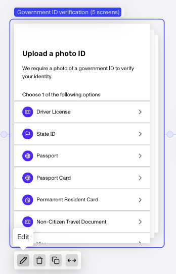
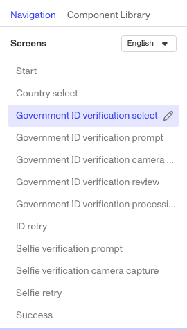
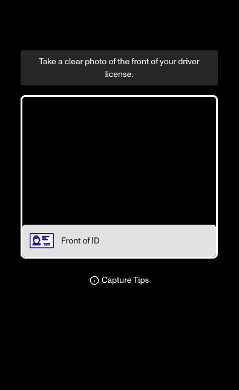
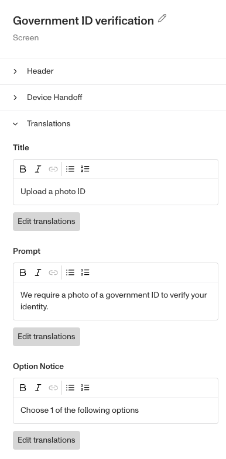

# Finding Inquiry UI feedback messages

⚠️ This question came from a prospect customer who wanted to better understand their end user Inquiry experience with the real time UI feedback.

### Question:

Where can I find all the UI feedback messages for end users going through an Inquiry?

### Answer:

Each of the Verifications included in a solution contains default feedback messages to end users to help them complete the inquiry flow. These messages can be customized by your team. These feedback messages are included and configured on the relevant verification screens. All text on a screen, including the feedback messages, are collected under the Translations dropdown.

### Navigation Steps:

1.  Open the Inquiry template.
    
2.  Select the Verification module by either:
    
    1.  Clicking the Steps button of the left nav and then selecting the Verification step.
    
    
    
    2.  Scroll through flow and select the Verification step.
    
    
    
3.  Once selected, click the **Edit** button for the Verification screen(s).
    
4.  This will open the Navigation window. For example, the Gov ID and Selfie solution will appear like the following:
    

5.  Select the Verification screen you want to inspect. Example:

6.  In the Screen properties window to the right, look for the Translations drop down. Scroll down through the various feedback messages. Some of them, like “Title” or “Prompt” are for components that are visible by default. Others, like “Unsupported Prompt”, will only be displayed when the UI has detected that an end user has run into a particular issue. Some screens will have many more feedback messages available than others. All feedback messages are tailored to that screen.

### Should you change the feedback messages?

Persona’s Inquiry team continues to refine the Inquiry experience and pays a great deal of attention to the effectiveness of UI feedback messages to help ensure the best end user experience. While we don’t recommend modifying the feedback messages, you are able to do so via the screens property editor in the inquiry template.

⚠️ This answer was last updated on August 13, 2024 by Ryan, a Growth content manager at Persona. FAQs, unlike other articles, are written to provide Persona Community members more specific answers to common questions. While we periodically review responses and answers, please note when this FAQ was last updated as information may have changed since then.

## Related articles

[Basic Verification Solution](./1dS7AaCL1XdfSivBVZhrOt.md)
