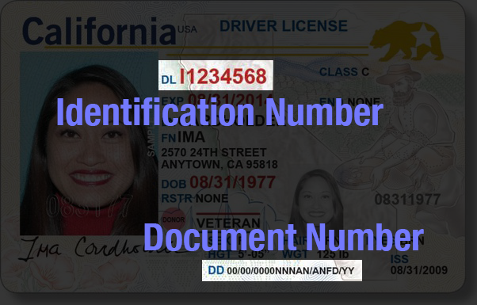

# Difference between Document Number and Identification Number?

⚠️ This question came from a member of the Persona Community - a senior engineering manager at a life insurance company. It is useful for those working with the Gov ID verification and two of it’s fields.

# Question

What is the difference between the fields of Identification Number v/s Document Number?

# Answer

It is possible for an ID to have both an `identification-number` and `document-number`.

-   An `identification-number` is a unique identifier for the individual.
-   A `document-number` pertains to the issued identification card.

In this example California driver’s license, there is both an `identification-number` and a `document-number`

On a California Driver’s Licenses, the number that identifies the driver is the DL, or Driver’s License number. The DD (Document Discriminator) contains a number that identifies the actual driver’s license ID card itself. Both of these are actually alphanumeric, but are referred to as numbers.

Governments will name these fields according to their systems, languages, and their ID’s layouts. Once Persona detects the ID type, it can find each of these fields, assuming the ID type includes them.

📌 This answer was last updated on Oct 8th, 2025, by Ryan Cole, a Growth Content Manager at Persona. FAQs, unlike other articles, are written to provide Persona Community members with specific answers to common questions. While we periodically review responses and answers, please note when this FAQ was last updated as information may have changed since then.
