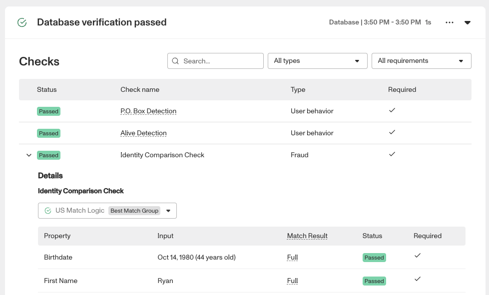
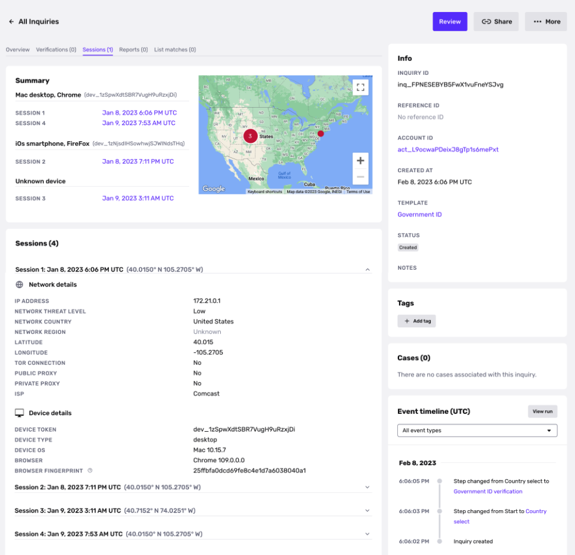
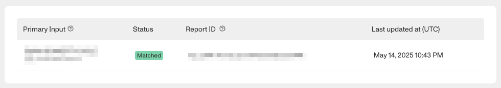
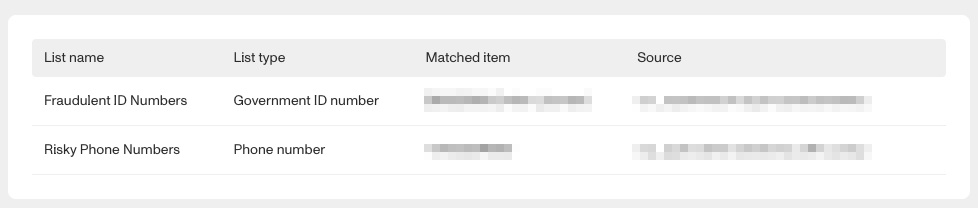
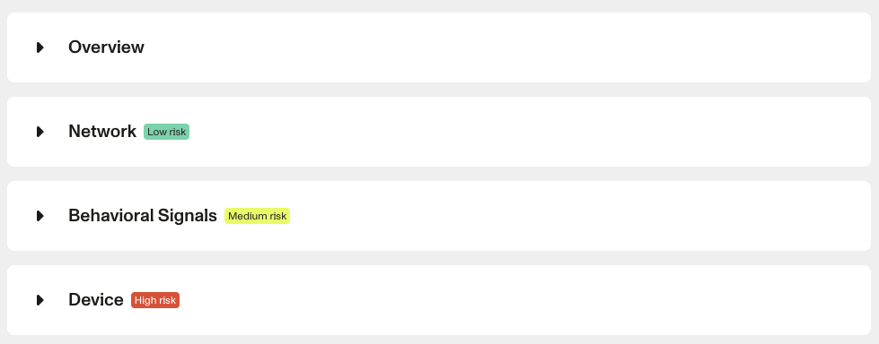
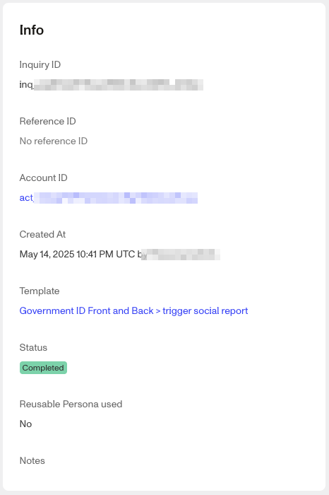
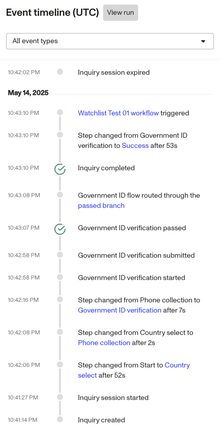

# Understanding Inquiry details

## Overview

This guide explains where to find information about your Inquiries in the Persona Dashboard.

### Prerequisites

This guide will be most helpful if you first review the [key concepts](./14hgKH7lZo9b6ja7tRJobW.md) in Persona, and [create your first Inquiry](./77Copw7LWJPHAUHCo318nk.md).

## All Inquiries view

The All Inquiries view shows a list of all of your Inquiries. To navigate to this page, select **Inquiries > All Inquiries** from the navigation bar.

The All Inquiries view lets you filter Inquiries by attributes including Inquiry [status](../../docs/docs/models-lifecycle.md#inquiry-statuses), Inquiry creation date, and type of Verification checks run on the Inquiry.

## Inquiry details view

The Inquiry details view shows details about a specific Inquiry.

To navigate to this page, visit All Inquiries, then select the Inquiry you're interested in.

## Tabs in the Inquiry details view

The Inquiry details view is divided into the following tabs:

### Overview tab

This tab contains a few sections:

-   **Summary**: statistics related to the Inquiry. For example, the time it took the end user to complete the Inquiry, or the number of Verification attempts.
-   **Collected**: a summary of attributes collected about the end user. For example, if the Inquiry included a Government ID Verification, an attribute may be the name that appeared on the ID.
-   **Location**: information about the location of the end user of the Inquiry. For example, the device where the Inquiry was completed, and the residence collected on any document(s) the end user submitted.
-   **Behavior Risk Signals**: Information about the user's behavior as they completed the Inquiry. For details, see [User behavior signals in an Inquiry](./11J1yKHLG0IKRWnvOKJ3ur.md).

### Verifications tab

This tab contains details of every Verification attempt that the end user made as part of the Inquiry.

Each Verification attempt is displayed in its own section. Each section contains:

-   Results specific to the type of the Verification. For example, for a Government ID Verification, results may include the photo of the ID that the end user submitted, and attributes extracted from the ID.
-   **Checks**: details of each Verification check that was run, including Name, Type, and Required. 
    -   To learn what these details mean, see: [Attributes of a Verification check in Inquiry results](./2Q2Mk72I8dHPC4MiF2noHo.md)

Below is an example of the Checks section within a Verification attempt. Complete details about each check are available in the [reference Verification checks table](https://app.withpersona.com/dashboard/resources/verification-checks/) in the Persona Dashboard.

**Note**: The ability to customize Verification checks is available to organizations on paid plans. You can customize checks based on your organization's goals for balancing risk and conversion. If you are on the Starter plan and would like to upgrade, please contact us [here](https://app.withpersona.com/dashboard/contact-us).

### Sessions tab

This tab shows the sessions an end user used to perform their Inquiry.

A session is a continuous interaction with an Inquiry that is specific to a device. If an end user performs a [device handoff](./1eWai1tzBuIZ8fA3QknyBd.md), a new session begins on the new device.

The Sessions tab shows:

-   **Summary**: An overview that includes:
    -   A map of all network locations in which sessions occurred.
    -   A list of each unique device used in the Inquiry, alongside the sessions performed on that device.
-   **Sessions**: the details of each individual session. Details include:
    -   **Time**: When the session began.
    -   **Network details**: Information about the network of the end user of the Inquiry. Includes IP address, network country and region, latitude and longitude, if the device was connected to a VPN, and more.
    -   **Device details**: Information about the device where the session occurred. Includes device type, operating system, browser version and fingerprint, and more.

### Reports tab

This tab displays any [Reports](./hI9YUPxjW7v46pFfyk6J1.md) that this end user matches on. Reports can include Global Watchlists, PEP Screens, and more.

### List matches tab

This tab displays any matches on a [List](./7IqWZFDaPjn8RTJtbgUjfV.md) for the end user, and what the matched item is.

For example, let's say you have a list of known IP addresses that you would like to block and have uploaded the IP addresses into a List; and you have set up a Workflow to automatically deny individuals that match those IP addresses. This tab would show details if the end user's IP address matches one on your List.

### Integration Logs

If a workflow the triggered off of the inquiry used an integration, a log would be generated and displayed here.

### Signals

This tab contains end user behavioral signals that can help detect and assess fraud risk.

## The Side Panels

On the right side of the Inquiry page are four panels that persist regardless of which tab you're currently viewing: Info, Tags, Cases,& Event timeline.

### Info

This panel displays common tokens like the Inquiry, Reference, and Account IDs, along with the template used and status.

### Tags

This panel allows users to add tags to the inquiry and displays any tags already attached to the inquiry.

### Cases

If the inquiry is attached to a Case, that case will be listed here.

### Event Timeline

A chronological listing of all events relevant to the inquiry from Inquiry create up to the most current event. If you’re looking to understand why an inquiry run didn’t behave as expected, start here.

