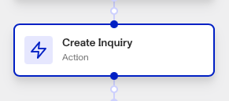

# Workflows: Create Inquiry step

# What is the Create Inquiry step?

**Create Inquiry** is a Workflow Action step that creates a new Inquiry based on a template. It can also relate the new Inquiry to an Account. This allows you to connect a singular interaction or attempt at verification (represented by the Inquiry) to a single user (represented by the Account). This allows you to keep a system of record of that user’s interactions and personal data organized together within Persona.

A Persona Inquiry represents a single instance of an individual attempting to verify their identity. Inquiries are created when the individual begins to verify their identity, and contains the information collected from the submitted verifications, the results of those verifications, and passively-collected contextual data like IP address that can be used to identify suspicious activity.

The Create Inquiry step is a key part of most verification workflows, since a verification attempt is represented by a newly created Inquiry. You can edit available templates for the Create Inquiry step in **Dashboard > Inquiries > Templates**.

A common practice is to create an Inquiry and to subsequently use that created Inquiry by sending it to the user via email or back to your systems to show within a user experience.

# How do you add a Create Inquiry step?

1.  Navigate to the Dashboard, and click on **Workflows** > **All Workflows**.
2.  Find and click on the workflow you want to edit, or **Create** a new workflow.
3.  Click on **+** when hovering over a circle to add an **Action**.

4.  Use the **Find Action** select box to click on **Inquiry > Create Inquiry**.
5.  Choose the **Inquiry Template** the new Inquiry should be based on.
6.  (Optional) Choose the **Account** the Inquiry should be attached to. The Account should correspond with Inquiry’s user.
7.  (Optional) In ‘Advanced Configuration’, click the **Continue on error** box if you want the workflow to continue running even if this step raises an error.
8.  **Close** the step. You’ll have to **Save** and **Publish** the workflow to begin using it.

# Plans Explained

## Create Inquiry step by plan

|  | Startup Program | Essential Plan | Growth Plan | Enterprise Plan |
| --- | --- | --- | --- | --- |
| Create Inquiry step | Limited | Available | Available | Available |

[Learn more about pricing and plans.](./6oZbzp7jb7AWGClF5vpY3K.md)

# Learn more

[Learn more about Inquiries.](../../docs/docs/inquiries.md)
