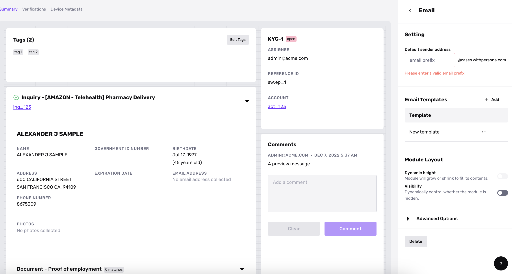
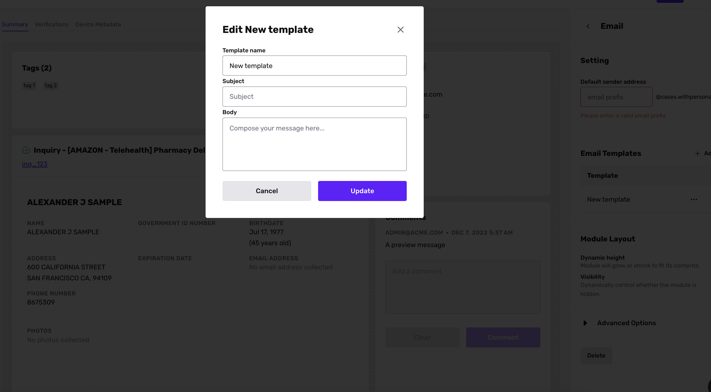

# Cases Email module

_The Cases Email Module is available to organizations on the Enterprise plan. If you are interested in streamlining your communications process with this Module, please reach out to your Customer Success Manager or [contact the Persona support team](https://app.withpersona.com/dashboard/contact-us)._

## Overview

Cases Email Module enables you to send and receive emails directly within the Persona Dashboard, allowing you to more easily communicate with your customers.

You can request missing or additional documentation from customers, automatically add that information into the Case list view, and view a history of previous email communications with customers. The Email Module supports email drafts, email templates, and embedded Inquiry links.

## How to use the Email Module

### Add the Module

1.  Navigate to the [Case template view](https://app.withpersona.com/dashboard/case-templates) and select the template you want to edit.
2.  Within the Component Library on the right hand side of the screen, select “Email” from the available pre-built modules. Drag it into your template.

### Configure required Email settings

The settings for the Email Module are shown in a sidebar on the right hand side of the screen.

1.  Input the "Default Sender Address" for your emails. 
2.  Create at least one Email Template. Click **\+ Add** to add a new entry to the Email Templates list. Then click **"..."** > **Edit** next to the new entry. This opens a modal where you can edit the email template’s name, subject, and body. 
3.  Optionally, you can configure additional settings such as Module Layout and Advanced Options for module enablement.

### Send an email

Return to the Case template view. Click **Compose** within the Email Module to craft and send messages.

## Related articles

[Why did my email attachment fail?](./3QmLXcECBb6rzlDOblpcse.md)
