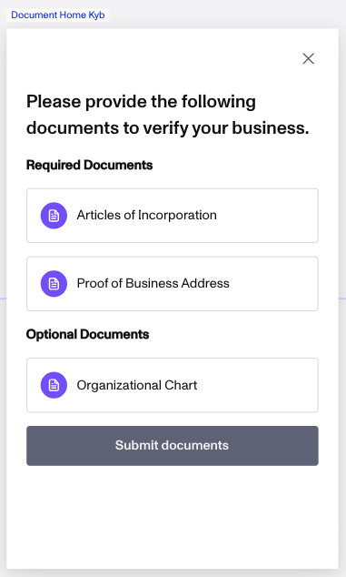
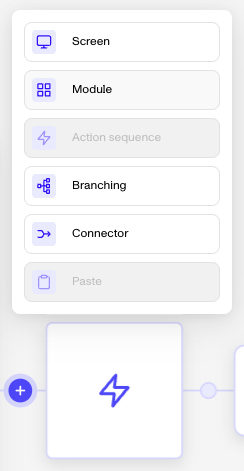
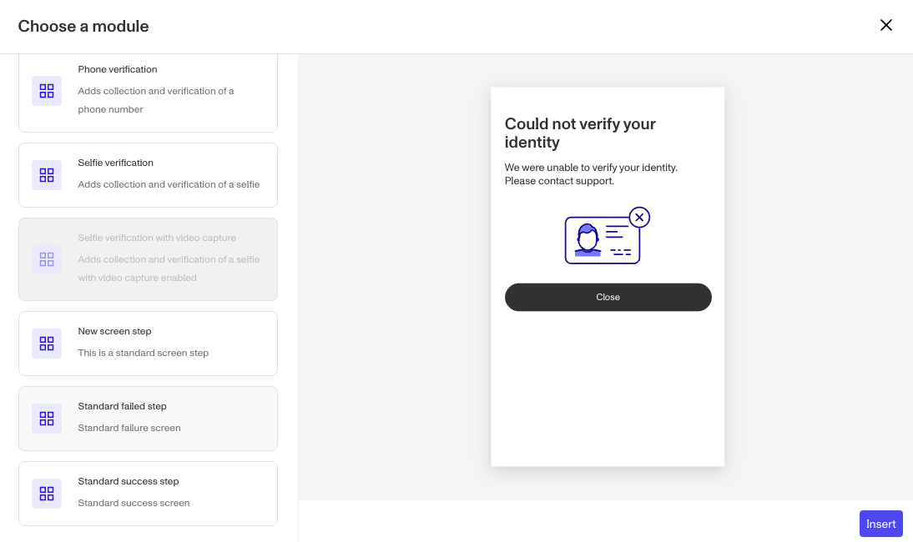
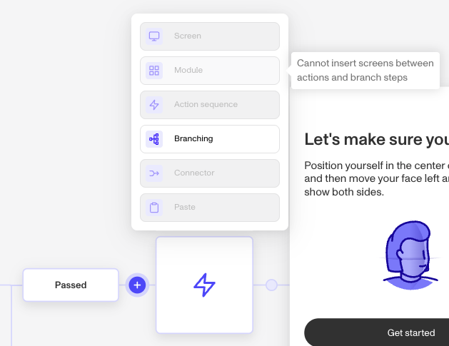

# Modules in Inquiries

## Overview

Modules are useful sets of prepackaged [screens](./2WWzr0d6rEOIlyXjtHSCgC.md) and/or [steps](./1z8F1l9Q28qNxQFtKoMfY3.md) that help you build an Inquiry flow.

Modules are just one type of building block in an Inquiry flow. See [this guide](./6CiQpUM6lROr10QmRXAqrP.md) for an overview of all the building blocks.

Below, learn:

-   Examples of modules
-   How to add a module
-   Where you can place modules

## Examples of modules

You can choose from modules such as:

### Verification types

Verification types are commonly added to a flow via a module. As these verification require multiple screens and steps, its easier to add them all at once as a module.

-   AAMVA Verification
-   Government ID Verification
-   Government ID verification (with autoclassification)
-   Government ID verification with video capture
-   Selfie Verification
-   Selfie Verification with video capture
-   Database Verification
-   Database [Aadhaar](https://uidai.gov.in/en/about-uidai/unique-identification-authority-of-india/vision-mission.html) Verification
-   Email Address Verification
-   Phone Number Verification
-   Document Verification

### Document Home Collection

The Document Home Collection screen is module that simplifies the collection experience for users while making designing the inquiry flow easier too. The module is combination screen and branching step. Each required doc and optional document has their own route to flow. Those routes handle the usual retry logic for the passing, failing, and retrying of the specific document verification. At the end of each path, the user is connected back to the doc home screen. Any completed docs are greyed out. Once the required documents are submitted, end users can exit the Document Home screen by clicking the “Submit documents” button. That will allow the flow to continue down the last route and complete the inquiry.

### Standard screens

The Standard Success Step and Standard Failed Step are both modules that consist of one screen. They are included as modules in the case that you want to add secondary Success or Failed Steps that you can customize.

-   Standard Success Step
-   Standard Failed Step

### Country select & Country select with branching

These modules includes a screen that asks the user to choose their country, as well as a conditional step that routes the user based on what they input. The second version of the module also includes a branching step based on configured countries.

-   Country select
-   Country select with branching

### Add a module

To add a module to your Inquiry flow:

1.  In the Dashboard, navigate to **Inquiries** > **Templates**.
    
2.  Select the Inquiry Template for your flow.
    
3.  In the Flow Editor, click the **“+”** sign in the Flow where you want to add a module.
    
4.  Select **Module** from the list of options.
    

5.  Choose a module.

6.  Click **Insert**.

### Module placement

The Flow Editor enforces rules about where a module can be inserted.

If it's not possible to insert a module at a given location in the flow, the Module option will be grayed out. You can hover over the grayed out option to see why.

