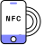

# Get verified on LinkedIn with Persona

# Get verified on LinkedIn with Persona

LinkedIn has partnered with Persona to help give you an easier way to build authenticity with your professional community.

## What you’ll need

  
**Passport with NFC chip**  
  
You'll need a government-issued passport with an NFC chip. Ensure your e-passport has the NFC logo.

  
**Mobile phone with NFC enabled**  
  
You'll also need a device to scan your passport that is NFC-enabled. (If you've ever used your phone to tap for payment, then it is NFC-enabled.)

### Notes

-   The LinkedIn app is required for this verification. The app must be set up with your LinkedIn username and password.
-   If you access the verification on desktop by visiting linkedin.com, you will be shown a QR code that you can scan using the LinkedIn App.

## FAQs

**I don’t see a ‘Verify with Persona’ button on my LinkedIn profile yet—what do I do?**

LinkedIn will be gradually rolling out the identity verification feature worldwide, using trusted partners like Persona. If you don’t see the option to add an identity verification to your profile, try updating the LinkedIn app on your phone or check back.

**Why wasn’t I able to successfully verify my identity on LinkedIn?**

Check [here](https://www.linkedin.com/help/linkedin/answer/a1631613) for some tips that may be helpful if you run into issues with adding identity verification to your profile using Persona.

## How to scan your passport with NFC

This guide provides tips on how to upload a passport in a Persona identity verification flow.

**Device requirements**

Ensure the device you’re using to scan your passport is NFC enabled. If you’ve ever used your phone to tap for payment, then your phone is NFC enabled. Otherwise, a quick Google search on your device will likely inform you.

**Passport requirements**

Look at your Passport and ensure it has the NFC logo on the front:

  
  

**Troubleshooting**

If you having trouble scanning your passport with your NFC-enabled device, try the following troubleshooting steps:

-   Remove any covers or cases from your passport and mobile device.
-   Try scanning the other side of the passport. RFID chips are typically embedded in one of the covers of your e-passport. Try scanning the inside and outside of both covers. You may need to move your phone around to find the chip
-   Make sure the mobile device touches the passport, with no gap between the two items. Hold your phone against your passport until the scan is complete.

**How is my ID and selfie information used and stored?**

For more information about how we store and use your data, please visit our [Privacy Policy](../../../landing/idv-privacy-policy.md).

**Will Persona share my data with LinkedIn?**

Although you’ll access Persona’s verification process through the LinkedIn app, Persona will be the party collecting certain personal data required to verify your identity (including an image of your passport and a selfie). Persona shares the following information about you with LinkedIn and will ask for your permission before doing so:

-   Your name (as it appears on your passport)
-   The type of ID document you’ve submitted to Persona to verify your identity (i.e., passport)
-   The issuer of that ID document

LinkedIn also receives a hashed, unique identifier generated by Persona. LinkedIn will use this and the above data for security purposes. LinkedIn doesn’t receive your biometric data or photos, numbers, or expiry or issue dates associated with your passport.

**What kind of ID do I need?**

At this time, you are required to use a an NFC-enabled passport.

## Troubleshooting during the verification process

**How do I enable camera permissions?**

If you've received an error message about your camera permissions, you'll need to enable the correct camera permissions for your browser and/or device.

If you're viewing the Persona verification flow via an iOS or Android app, check your device settings:

-   Go to Settings on your device
-   Go to Apps
-   Find the app that you wish to enable camera permissions for
-   Find the App Settings and allow camera permissions

**What are tips for submitting a photo of my government ID?**

Here are some tips to help you submit a photo of your NFC-enabled passport:

-   Make sure the lighting in the room is bright enough to capture the picture of your passport.
-   If there is glare in your photo, move away from direct light to reduce glare.
-   Make sure the text on your passport is readable (and not worn).
-   Make sure you are not covering any part of the passport (e.g. with your finger).
-   Make sure the photo of your face on the passport is visible.
-   Make sure the image is not blurry.
-   If your camera quality is poor (e.g. the image is grainy or small) or you do not have a camera on your device, you can upload a photo of your passport and make sure it meets the above requirements.

## Biometric Information

To confirm your identity, Persona will generate facial geometries for both the image obtained from your government ID and the user submitted selfie. These geometries are then compared in a 1:1 analysis to determine whether the live individual is the same as the one identified in the government ID. Persona deletes your facial geometry measurements immediately after processing and retains other data, such as your selfie and government ID data, for up to 30 days.

## About Persona

Persona helps businesses verify their users' identities, which enables them to fight fraud, stay compliant, and build better relationships with their customers by ensuring trust and safety on their platform.

For information on Persona's Terms of Service: [https://withpersona.com/idv-tos](../../../landing/idv-tos.md)

## For further assistance

For further assistance with verifying your LinkedIn profile through Persona: [visit this link](https://inquiry.withpersona.com/verify?inquiry-template-id=itmpl_PRWf1FbmTJaTyq75PuXdoATXvJE6&environment-id=env_ppbEzyrwfaY7vayexaNn8i2q&routing-country=DE&shard=de1).

Select a language...ArabicBulgarian (Bulgaria)BengaliCzech (Czech Republic)Danish (Denmark)GermanGreek (Greece)English (US)SpanishEstonian (Estonia)Finnish (Finland)FrenchIrish (Ireland)Hausa (Nigeria)Croatian (Croatia)HungarianIndonesian (Indonesia)ItalianLithuanianLatvian (Latvia)MalayMaltese (Malta)Dutch (Netherlands)PolishPortuguese (Brazil)RomanianSlovak (Slovakia)Slovenian (Slovenia)SwedishSwahili (Kenya)Tagalog
