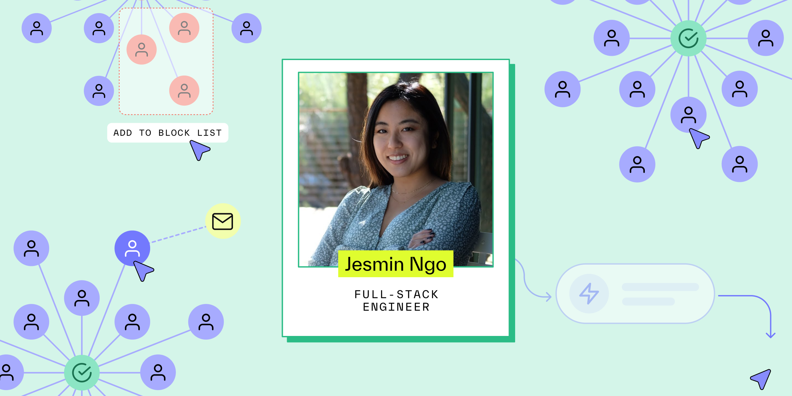

# 7 things I learned from building Persona’s Graph product

Published September 11, 2024

Last updated February 06, 2026

# 7 things I learned from building Persona’s Graph product

Jesmin Ngo, a full-stack engineer at Persona, reflects on the product and engineering lessons she's learned while building Graph — Persona's link analysis tool.

Jesmin Ngo

11 mins

