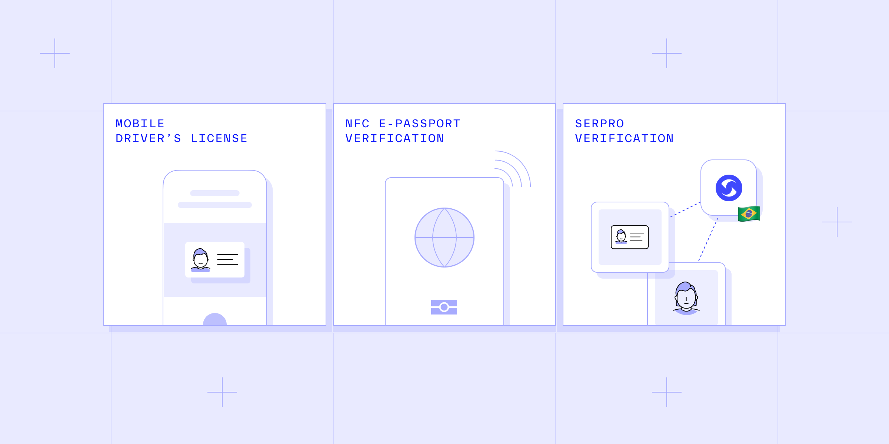

# A better customer verification process: How Persona is paving the way with NFC, mDL, and other new technologies

Published November 15, 2022

Last updated January 21, 2026

# A better customer verification process: How Persona is paving the way with NFC, mDL, and other new technologies

The verification process has never been more efficient thanks to the deployment of new technologies.

Tim Stobierski

9 mins

Key takeaways

New technologies can help you adapt as fraud techniques evolve.

Accepting mobile driver’s licenses for verification can dramatically reduce friction and help you increase conversions.

NFC e-passport verification can help you reduce instances of passport fraud by making it easier to identify forged or Photoshopped documents.

Adding Serpro verification offers you an added layer of protection, empowering you to recognize and catch more fraudulent IDs.
