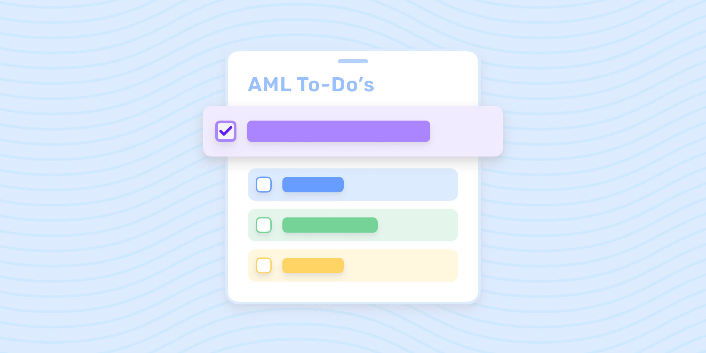

# The AML compliance checklist: best practices, tools, and processes

Published October 24, 2022

Last updated January 12, 2026

# The AML compliance checklist: best practices, tools, and processes

In this AML checklist, we’ll briefly go over the five AML pillars, then dive into four processes that can help improve AML compliance.

Doug Bonderud

5 mins

Key takeaways

A comprehensive anti-money laundering (AML) program should be centered around complying with the five AML pillars.

Conducting an AML risk assessment will empower you to implement a risk-based approach to AML as recommended by FinCEN.

Customer due diligence, AML screenings, and transaction monitoring are essential components of a modern AML program.
