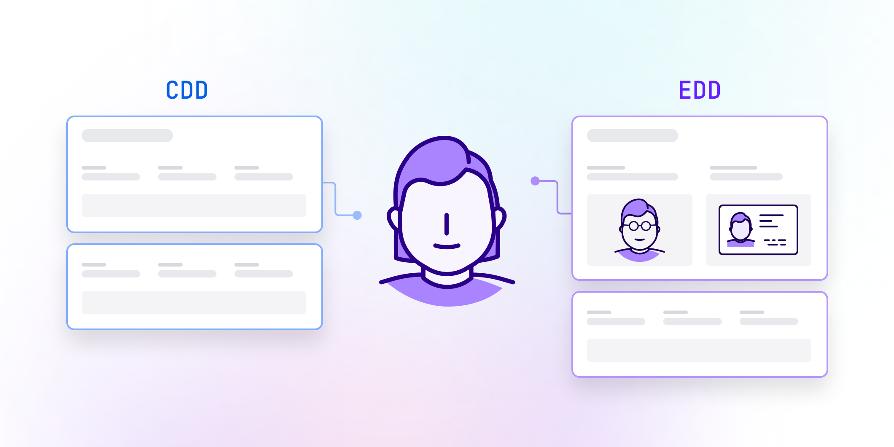

# CDD vs EDD: What’s the difference?

Published October 24, 2022

Last updated January 12, 2026

# CDD vs EDD: What’s the difference?

Explore how CDD and EDD work and learn when each is necessary.

Tim Stobierski

7 mins

Key takeaways

Customer due diligence (CDD) refers to a set of KYC processes designed to assess customer risk. It usually involves collecting and verifying personal information about prospective and current customers.

Enhanced due diligence (EDD) refers to protocols that are followed when an individual or transaction is deemed to carry a higher risk of money laundering or other financial crime.

EDD may include processes such as more stringent identity verification, source of funds verification, continuous monitoring, and other screenings.
