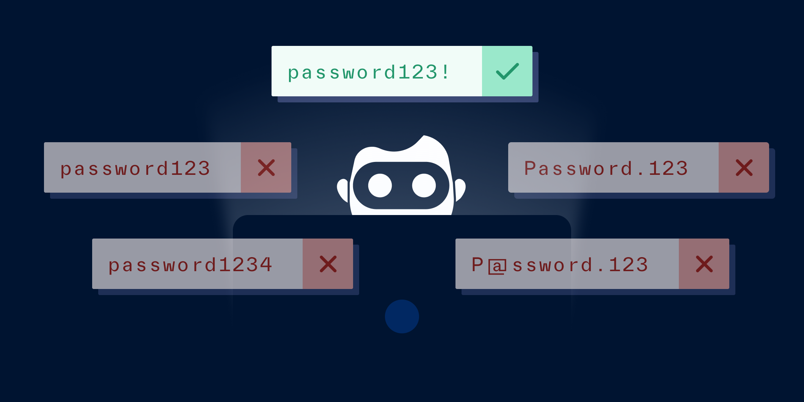

# Credential stuffing vs. password spraying

Published October 24, 2022

Last updated January 12, 2026

# Credential stuffing vs. password spraying

Learn how these two attacks differ and how to protect your business.

Tim Stobierski

9 mins

Key takeaways

Credential stuffing is a type of password attack in which a bad actor gains access to a user’s credentials for one online account, and then tries to use those credentials to access other online accounts.

A password spraying attack is a type of password attack in which a bad actor doesn’t know an individual’s password, but instead cycles through a list of the most commonly-used passwords to attempt to log in to a user’s account.

Some ways to prevent credential stuffing and password spraying include disallowing common passwords, limiting log-in attempts, using firewalls, implementing 2FA, and more.
