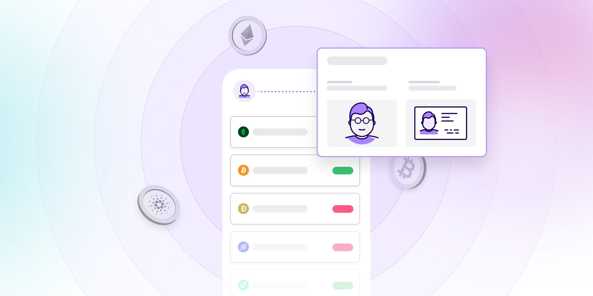

# Decentralized exchanges and KYC

Published October 24, 2022

Last updated January 12, 2026

# Decentralized exchanges and KYC

It's important for decentralized exchanges to get ready for KYC and AML regulations now so they will be prepared if and when they find themselves subject to the rules.

Tim Stobierski

11 mins

Key takeaways

Decentralized exchanges (DEXs) are crypto exchanges designed to facilitate peer-to-peer transactions, which reduces transaction costs.

DEXs are much more anonymous than their traditional counterparts — users just need to connect a cryptocurrency wallet to the exchange to get started.

While DEXs aren't subject to KYC/AML regulations right now, many think they will be eventually since crypto exchanges are now regulated.

Even if DEXs aren't subject to KYC/AML regulations in the short term, embracing the key tenets of KYC compliance can benefit the space.
