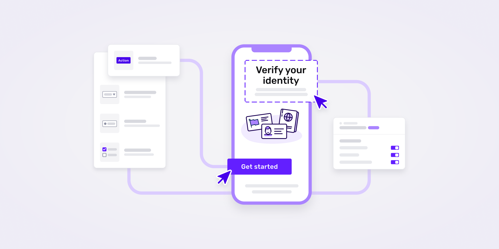

# Designing an app builder with server-driven UI

Published October 24, 2022

Last updated January 21, 2026

# Designing an app builder with server-driven UI

Making the Persona app more configurable wasn't enough — we had to design and construct an app builder.

Charles Yeh

5 mins

