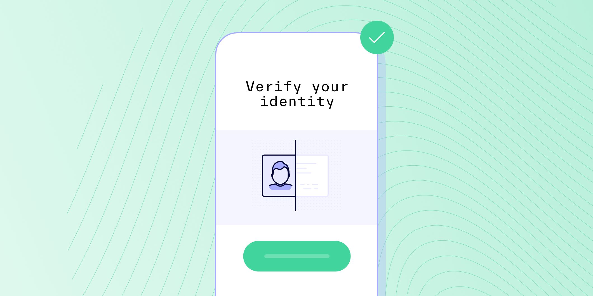

# Understanding the Document Verification Process

Published October 24, 2022

Last updated January 12, 2026

# Understanding the Document Verification Process

See how document verification works and how it can benefit your business.

Tim Stobierski

7 mins

Key takeaways

Document verification is the process of verifying whether a document — such as a bank statement, employment record, business document, etc. — is authentic or not.

The document verification process can usually be broken down into four steps: document collection, data extraction, document validation, and manual verification.

Digital document verification can help you meet regulatory requirements, mitigate fraud, build trust, and onboard customers faster.
