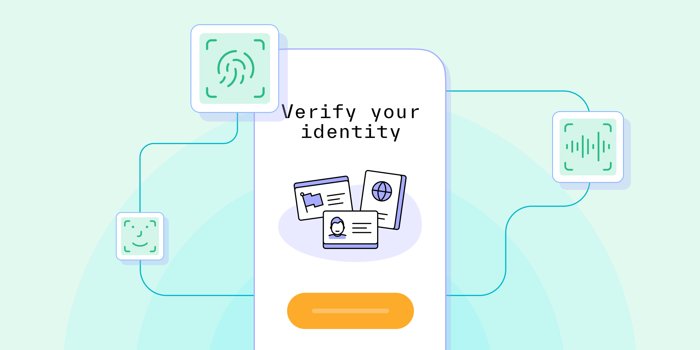

# eIDV: A better way to protect your business and customers

Published March 06, 2023

Last updated January 12, 2026

# eIDV: A better way to protect your business and customers

Discover how to prevent fraud, streamline business operations, and increase conversions by electronically verifying your customers’ identities.

Doug Bonderud

5 mins

Key takeaways

Electronic identity verification (eIDV) is the act of verifying a person’s identity digitally or electronically — whether through a computer or a mobile device.

eIDV employs many of the same strategies as manual, in-person identity verification, but also allows you to collect a wide swath of additional details and risk signals.

Benefits of eIDV include scalability, faster processing time, and more.
