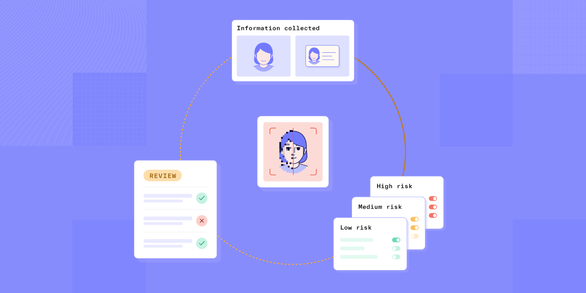

# Fight fraud at every angle with Persona

Published October 18, 2023

Last updated January 21, 2026

# Fight fraud at every angle with Persona

Introducing new capabilities to help fight complex fraud.

Rick Song

8 mins

Key takeaways

Fraud is more adaptive, pervasive, and costly than ever.

With Persona, you can stay ahead of shifting fraudsters with more risk signals, catch bad actors at every stage of the customer life cycle without unnecessary friction, and respond faster to fraud attacks with no-code orchestration for all of your tools.
