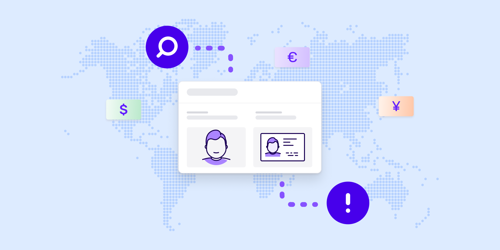

# Global AML compliance: Is your business doing enough?

Published October 24, 2022

Last updated January 12, 2026

# Global AML compliance: Is your business doing enough?

Discover some of the regulations and protocols you’ll need to know and remember when conducting business internationally

Jenna Lee

6 mins

Key takeaways

The FATF is an inter-governmental body whose mission is to lay out protocols every country and business can use to protect themselves against money laundering.

Following FATF's guidelines is not enough to achieve international compliance — you need to understand and follow the local regulations in every area in which you do business.

Failure to follow AML regulations can result in heavy fines, reputational damage, and even criminal penalties, such as time in prison.
