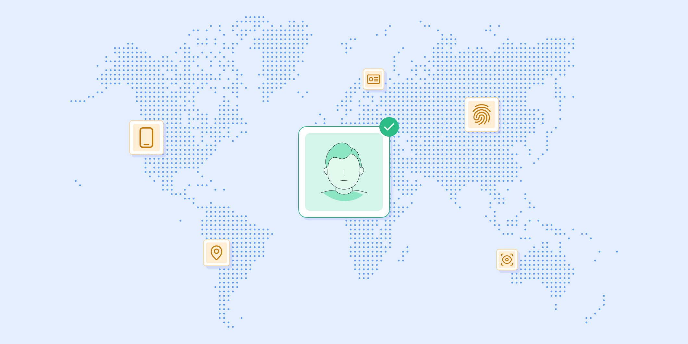

# Global KYC: A KYC breakdown by countries

Published November 08, 2022

Last updated January 12, 2026

# Global KYC: A KYC breakdown by countries

Learn how KYC regulations differ by country.

Tim Stobierski

13 mins

Key takeaways

If your business operates internationally, it’s critically important to understand the specific laws and regulations governing each jurisdiction you operate within.

Each country has the authority to establish the KYC laws and regulations that govern its jurisdiction as it sees fit. As a result, global KYC laws can vary significantly.
