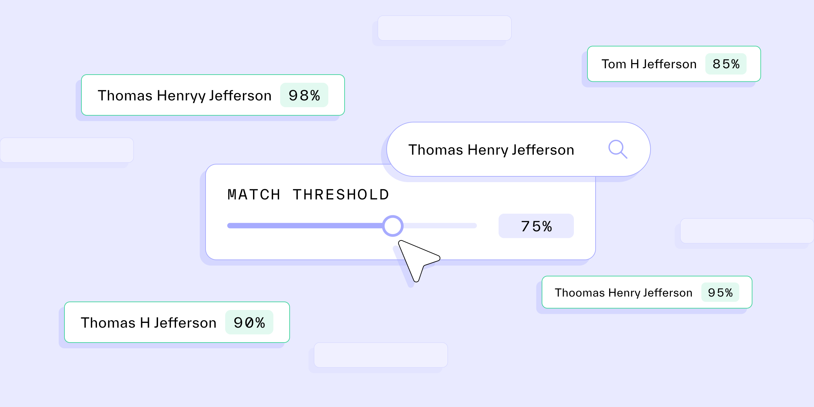

# How match requirements allow you to fine-tune your IDV processes

Published November 22, 2022

Last updated January 12, 2026

# How match requirements allow you to fine-tune your IDV processes

Setting name match requirements is an important part of the identity verification process. Learn more about why it’s important to get them right.

Tim Stobierski

9 mins

Key takeaways

Match requirements refer to the internal logic that you set for determining whether or not a variation of a piece of data (such as aliases, nicknames, alternative spellings, or misspellings) will trigger a “match” when found in a report or other type of verification.

Your match requirements determine how wide you are casting your net as you search for potential matches.

Determining the match requirements for your business will require you to balance friction against security.
