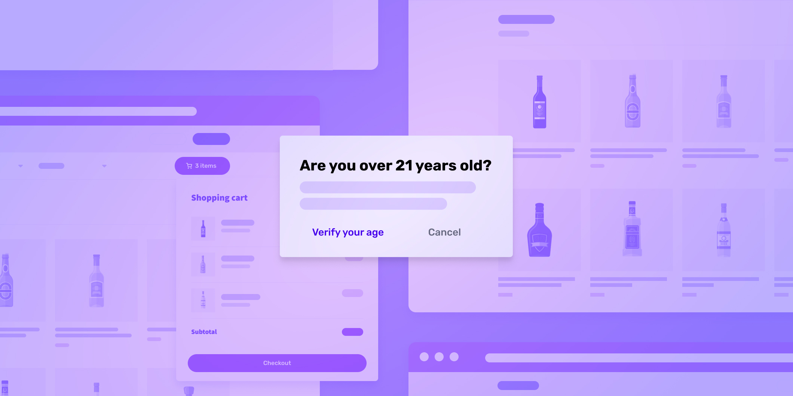

# How to implement an age verification system for your business

Published October 24, 2022

Last updated January 12, 2026

# How to implement an age verification system for your business

Any business that sells age-restricted products, provides access to age-gated activities, or delivers services that require adult consent must verify ages. Learn more.

Jeff Sakasegawa

17 mins

Key takeaways

Any business that sells age-restricted products, provides access to age-gated activities, or delivers services that require adult consent must verify ages.

Age gates don't really don’t qualify as a form of age verification because they don’t actually _verify_ that the information provided by the user is accurate.

Age verification is usually accomplished through government ID verification.
