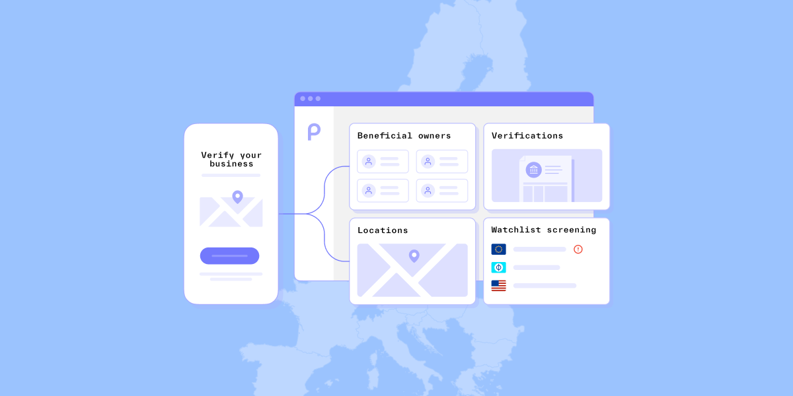

# Onboard businesses globally with Persona's international KYB solution

Published February 28, 2024

Last updated January 13, 2026

# Onboard businesses globally with Persona's international KYB solution

Streamline global business onboarding with Persona's international KYB solution, ensuring compliance and a seamless experience across borders.

Neel Bhoopalam

9 mins

Key takeaways

Each geography has its own identity nuances — whether it’s what data is actually available for verification, what end users want to present at onboarding, or the compliance laws at stake. 

With Persona, you can solve for global business verification and define your ideal KYB process while maintaining localized experiences.
