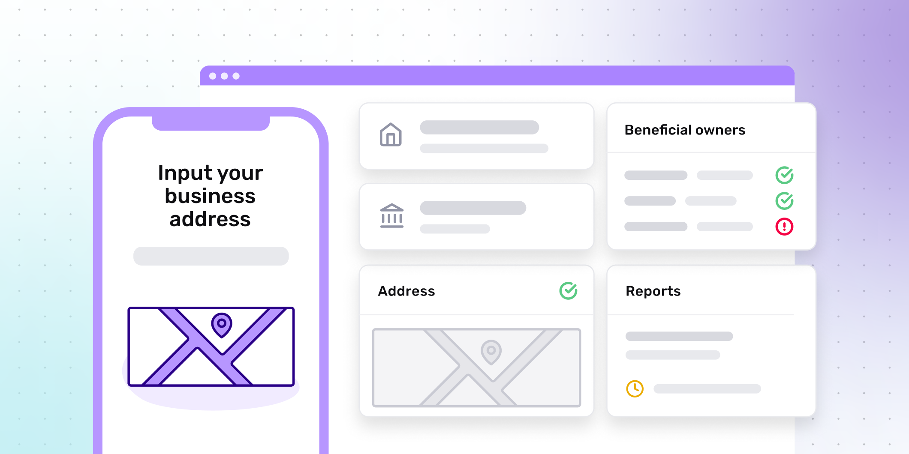

# Know Your Business (KYB) 101

Published October 24, 2022

Last updated January 13, 2026

# Know Your Business (KYB) 101

Learn what KYB is, why it matters, who needs it, and more.

Shana Vu

6 mins

Key takeaways

KYB is the process of verifying companies and the individuals behind those companies.

KYB matters because it’s sometimes required, it can help mitigate fraud, and it can help build trust and safety in your business.

Financial companies are required to complete KYB verification. However, with KYB, it’s important to also consider your use case — not just your broader industry.
