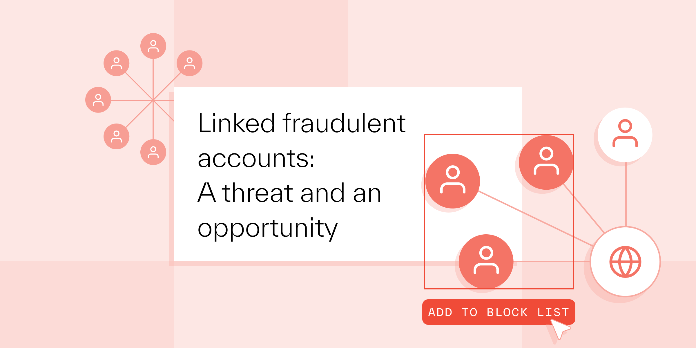

# Linked fraudulent accounts: A threat and an opportunity

Published April 26, 2023

Last updated January 12, 2026

# Linked fraudulent accounts: A threat and an opportunity

Spotting a fraudster on your platform is like spotting ants in your kitchen. If you see one, there are probably hundreds or thousands hidden behind the wall.

Jeff Sakasegawa

7 mins

Key takeaways

Understanding how fraudulent accounts are linked by activity or shared data points — such as IP addresses, browser or device fingerprints, payment details, etc. — makes it easier to quickly investigate, flag, and ban bad actors.

It's vital to embrace an end-to-end fraud strategy to proactively fight fraud wherever it happens in the customer lifecycle — while also making it harder for repeat offenders to reestablish themselves on your platform.

Implementing deterrence at onboarding, introducing friction at high-risk moments, and exposing connected accounts can all help deter fraud.
