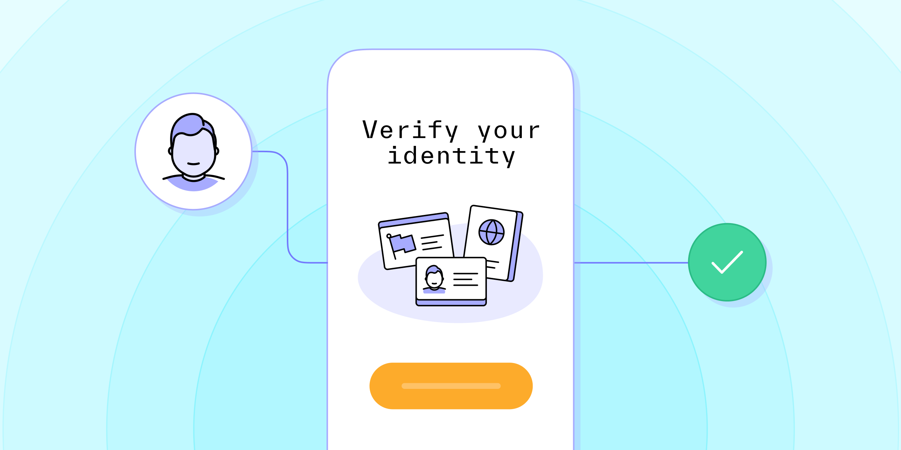

# Mobile KYC: How will it transform compliance?

Published November 22, 2022

Last updated January 12, 2026

# Mobile KYC: How will it transform compliance?

Improve your verification processes with mobile KYC.

Tim Stobierski

8 mins

Key takeaways

Mobile KYC is the process of verifying someone’s identity via a mobile device such as a smartphone.

Implementing mobile KYC processes can offer you another opportunity to meet your users and customers where they are.

Mobile KYC also empowers you to leverage verification techniques and technologies that are not typically supported by or optimized for desktop verification.
