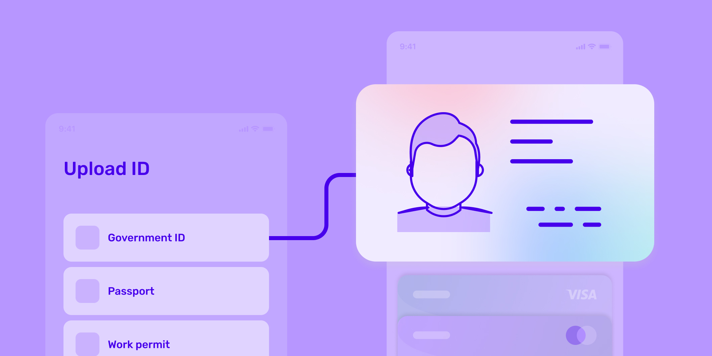

# New at Persona: Mobile driver's license (mDL) verification via Apple Wallet

Published October 24, 2022

Last updated January 21, 2026

# New at Persona: Mobile driver's license (mDL) verification via Apple Wallet

Organizations that obtain Apple's entitlement will be able to accept mobile driver’s licenses (mDLs) as a form of identification within Persona’s verification flow.

Daniel Lee

5 mins

Key takeaways

With mDLs, you no longer need to ask users to re-submit IDs due to suboptimal ID extraction or quality.

Unlike photos of IDs, which can be leaked and reused, mDLs are encrypted and stored on devices, which greatly lowers the chance of identity theft.

Because the information is pre-validated, accepting mDLs can give you higher assurance against fraudulent driver’s license submissions and tampered biometric information.
