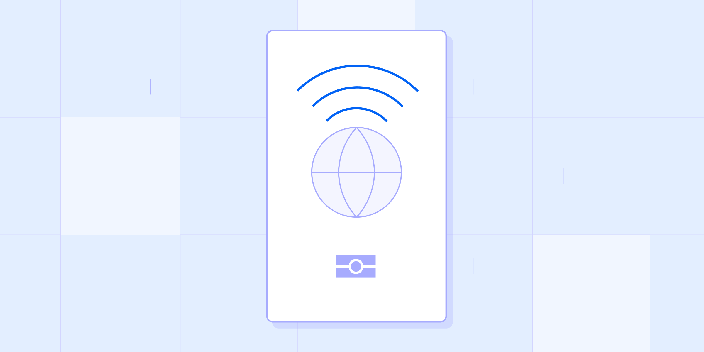

# NFC passport verification: A guide

Published December 06, 2022

Last updated January 12, 2026

# NFC passport verification: A guide

NFC passport technology allows for a more secure identity verification process while improving usability. Learn how it works.

Tim Stobierski

11 mins

Key takeaways

An NFC (near-field communication) chip can best be thought of as a cross between a computer chip and an antenna that is capable of communicating with nearby devices.

The main reason a business might implement NFC passport verification is to reduce the risk of passport fraud.

Including NFC verification as a part of your e-passport verification processes can add an extra layer of security and defense against forged documents, as NFC chips are difficult to forge.
