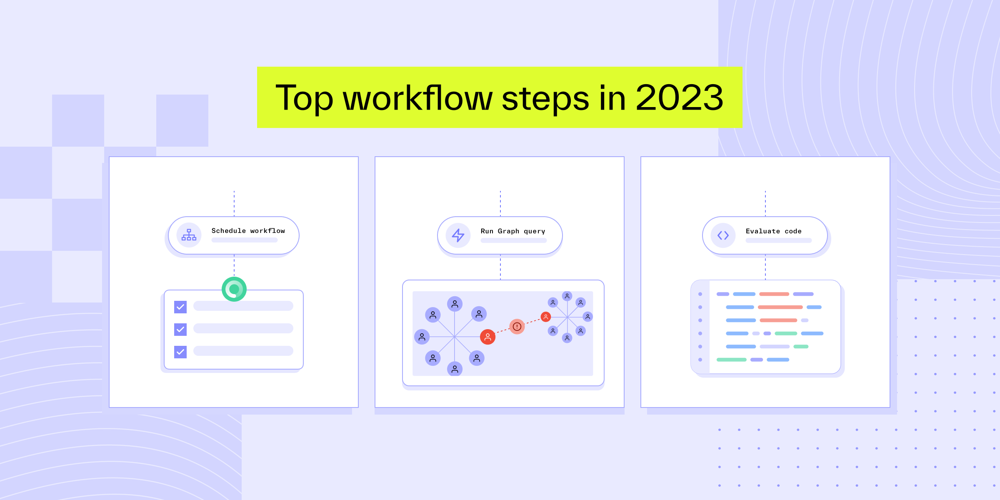

# Optimize your identity processes with our top orchestration resolutions

Published January 10, 2024

Last updated January 28, 2026

# Optimize your identity processes with our top orchestration resolutions

Learn how Workflows automates identity processes, compliance, and fraud prevention. See how more data leads to better decisions.

Ross Freiman-Mendel

5 mins

Key takeaways

Steps like tag object, redact object, and schedule workflow enable product and risk teams to implement complex automations that reference past decisions, trigger future action, and capture complex interactions that occur outside of Persona.

With Workflows, customers never have to manually mark individual inquiries for review or click through their Persona dashboard to run a report.

Writing their own code allows our customers to automate beyond our action library, enabling deeper customization with and integration into their systems and data sources.
