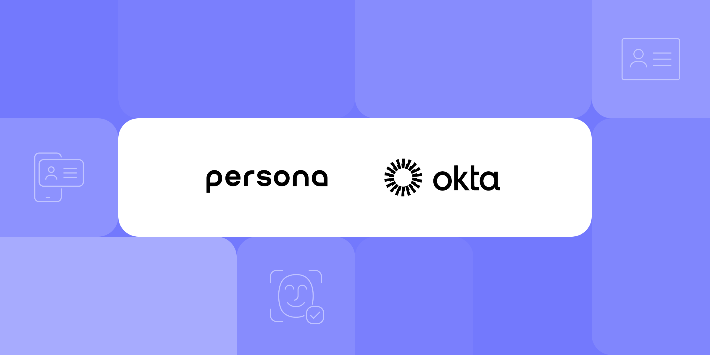

# Workforce security redefined: Persona and Okta partner to verify identities and protect against phishing and deepfakes

Published October 15, 2024

Last updated January 21, 2026

# Workforce security redefined: Persona and Okta partner to verify identities and protect against phishing and deepfakes

Enforce identity verification throughout the employee life cycle using Persona and Okta’s out-of-the-box integration for identity verification.

Joshua Rodriguez

7 mins

