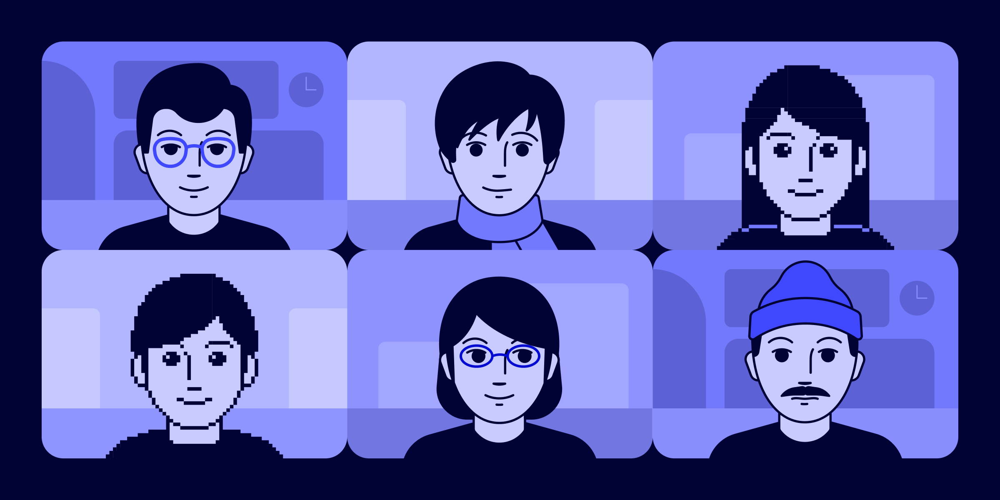

# How to protect your business against AI-based face spoofs

Published January 21, 2025

Last updated January 13, 2026

# How to protect your business against AI-based face spoofs

AI-generated face spoofs are challenging for humans and vision-based AI models to detect. Learn how to protect your business with a holistic strategy that goes beyond visual detection.

Daniel Lee

10 min

Key takeaways

AI-based face spoofs are fake photos or videos created by manipulating images of real faces or generating completely synthetic ones. 

When bad actors use deepfakes and other AI-based face spoofs in attempts to bypass identity verification measures, they leave behind traces you can take advantage of.

Businesses can set themselves up for success by following our four-part framework for combatting AI-based face spoofs: collecting and verifying more active and passive data, combining data and signals to derive more insights, clustering links to uncover scaled attacks, and customizing the user journey with dynamic friction based on real-time signals.
