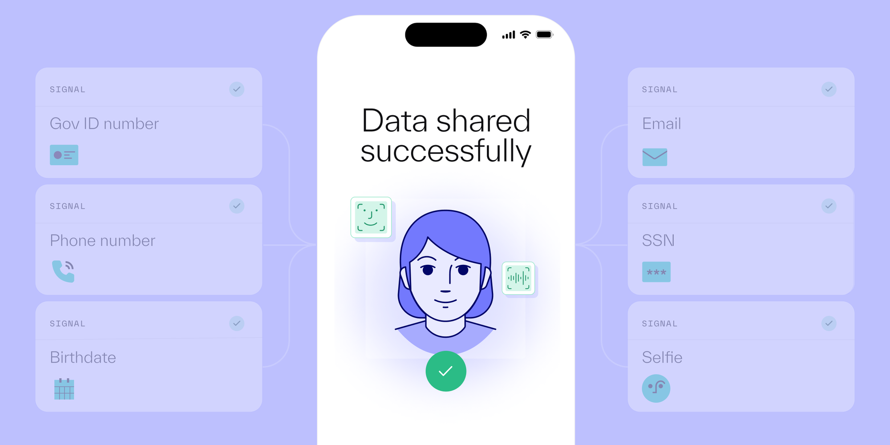

# Faster verifications and less risk with Reusable Personas

Published October 20, 2023

Last updated January 21, 2026

# Faster verifications and less risk with Reusable Personas

Verify more users while assessing more risk signals with reusable identities.

Justin Lo

6 mins

Key takeaways

To date, no reusable identity has succeeded in comprehensively addressing companies’ compliance and flexibility needs while offering the privacy and security assurances end users desire.

Reusable Personas, Persona’s reusable identity, offers the best of both worlds by allowing users to seamlessly store and reuse their verified PII via Passkey while enabling businesses to holistically evaluate risk without sacrificing the user experience.

Even though every Reusable Persona is based on verified PII, all the data on board is still passed through the verification process without requiring the end user to resubmit everything. This allows companies to seamlessly maintain their risk assurance with their unique set of checks and step up or step down verifications via .
