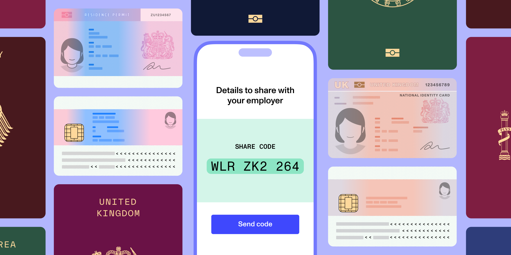

# Share codes: Digitizing the UK right to work

Published December 13, 2024

Last updated January 29, 2026

# Share codes: Digitizing the UK right to work

Before any UK company hires a non-UK citizen, it must verify that the individual has the right to work in the country. Share codes are a key step in this process.

Justin Lo

7 min

Key takeaways

Share codes offer UK employers a digital means of verifying that non-UK, non-Irish citizens have the right to work in the country. 

To conduct an online share code check, employers must collect a prospective employee’s date of birth and a valid share code.

Employers must securely store the share code check results for the length of the prospective employee’s employment, plus an additional two years. 

With the rollout of share codes, UK employers can now digitize their entire hiring process by performing digital identity verification for UK and Irish citizens and share code verification for non-citizens.
