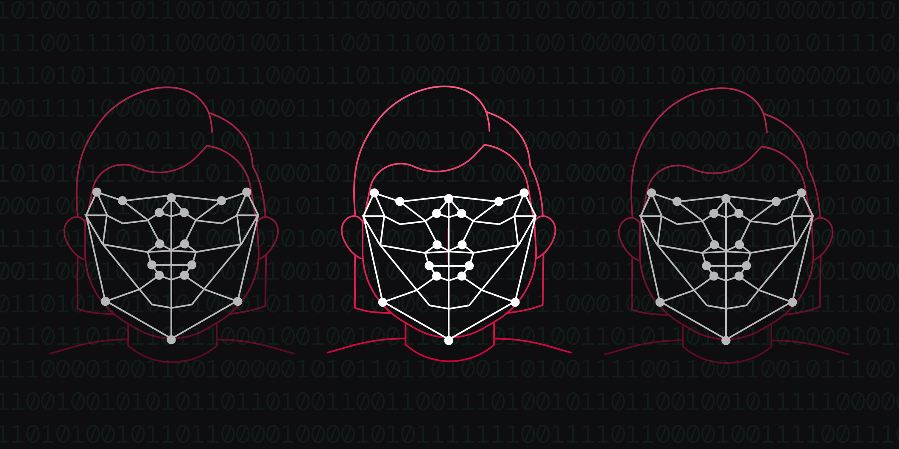

# Should a private company own taxpayer data?

Published October 24, 2022

Last updated January 12, 2026

# Should a private company own taxpayer data?

Recent controversies involving the IRS’s use of third-party ID verification service providers raise an important question: What’s the right way to handle identification of taxpayers online?

Rick Song

7 mins

