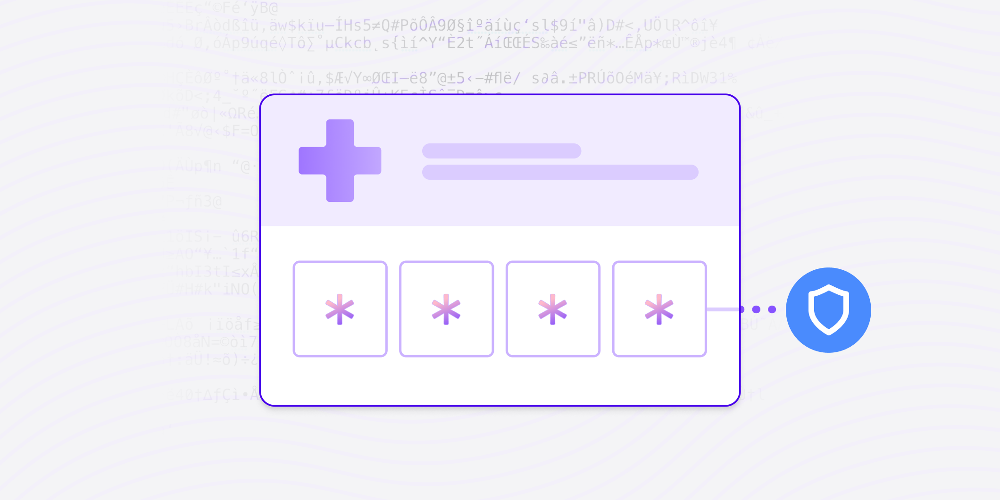

# 5 best practices for securing health data

Published October 24, 2022

Last updated January 12, 2026

# 5 best practices for securing health data

Healthcare organizations must prioritize data security to protect patient information and ensure regulatory compliance. Learn how.

Doug Bonderud

8 mins

