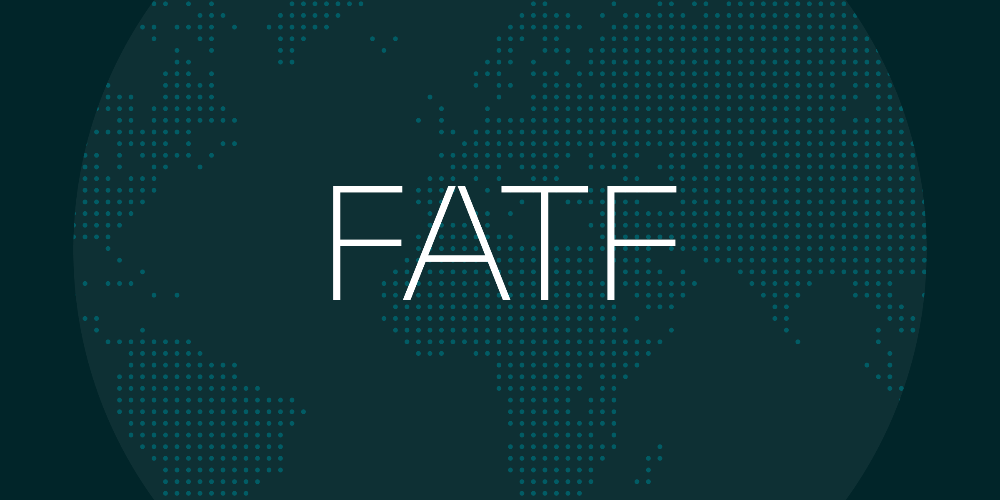

# Understanding and implementing FATF’s 40 Recommendations

Published January 23, 2023

Last updated January 12, 2026

# Understanding and implementing FATF’s 40 Recommendations

Learn how FATF's 40 Recommendations to combat money laundering can impact your policies.

Doug Bonderud

10 mins

Key takeaways

The FATF Recommendations introduce standards and policies for member countries to implement to help prevent money laundering and the financing of terrorism.

Following FATF’s guidance can only improve the safety and well-being of your business, your customers, and the world at large.
