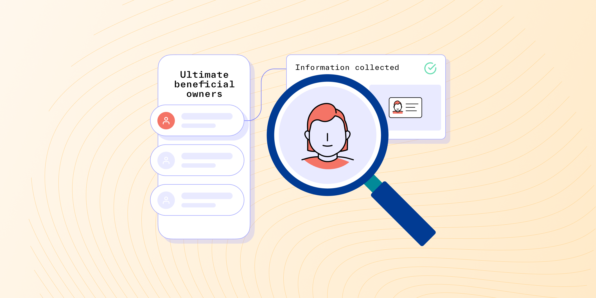

# Understanding ultimate beneficial owner (UBO) checks

Published October 28, 2022

Last updated January 12, 2026

# Understanding ultimate beneficial owner (UBO) checks

Learn about this essential step in managing your risk and complying with AML regulations.

Doug Bonderud

5 mins

Key takeaways

An Ultimate Beneficial Owner, or UBO, is any person who owns a significant portion of a company.

Identifying and verifying UBOs is an essential part of the Know Your Business (KYB) process.

If your company operates in the financial space, you are legally required to complete UBO checks as part of AML protocols.
