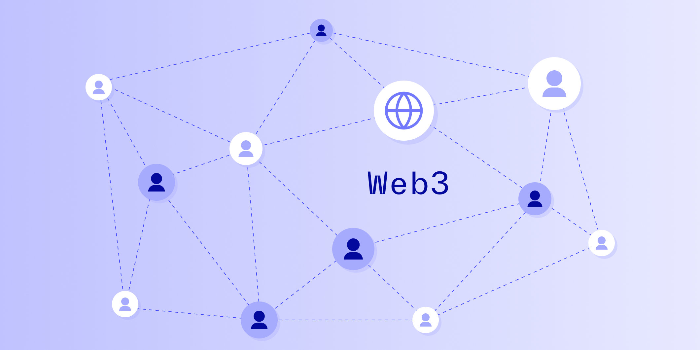

# Web3 could be huge: How it handles trust and identity will be critical

Published October 24, 2022

Last updated January 12, 2026

# Web3 could be huge: How it handles trust and identity will be critical

Web3 just might be able to bridge the gap between an individual’s physical identity and their digital identity.

Rick Song

7 mins

