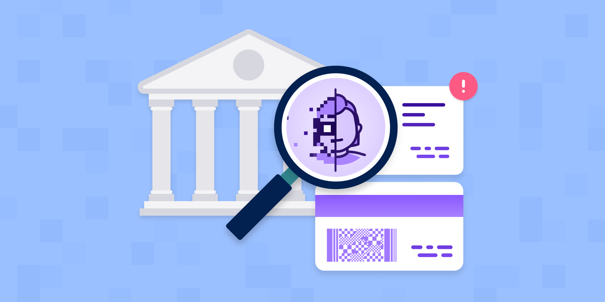

# What are issuing database verifications?

Published October 24, 2022

Last updated January 12, 2026

# What are issuing database verifications?

Issuing database verifications are one of the best ways to reduce fraud in your business. Learn more.

Jenna Lee

9 mins

Key takeaways

Issuing databases are maintained by government agencies that issue IDs and other official documents.

Businesses can query some issuing databases during the identity verification process to ensure that the information provided by an individual matches the official record. 

AAMVA and TIN verification are examples of domestic issuing databases. Serpro and DVS are examples of international issuing databases.

Issuing database verification, when paired with other verification methods, can result in high assurance.
