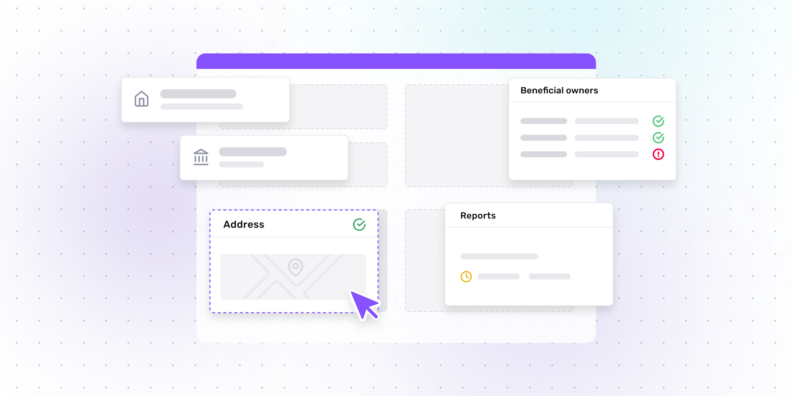

# How to build a Know Your Business (KYB) process

Published October 24, 2022

Last updated January 12, 2026

# How to build a Know Your Business (KYB) process

Learn what to consider when building a KYB process, what metrics to think about, what to look for in a KYB vendor, and more.

Jenna Lee

8 mins

Key takeaways

When implementing KYB, it's important to think about conversion, catching fraud, compliance, consistency, and more.

Before building your KYB process, think about your overall business goals, needs, and what you already have.

With Persona, you get a fully customizable collection and verification engine, automation, and all the information you need in one place.
