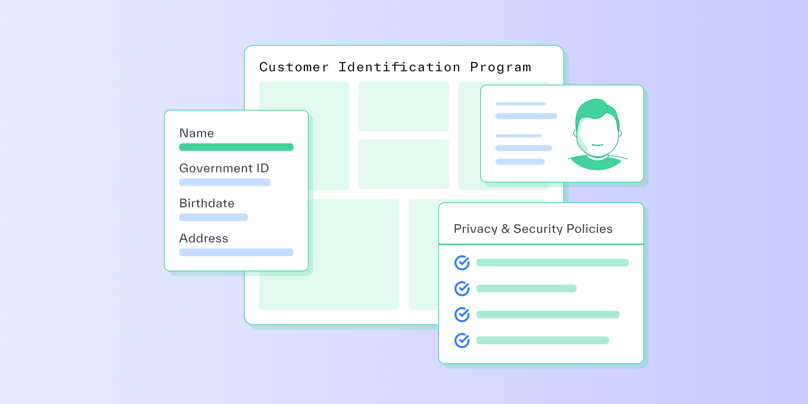

# What is a Customer Identification Program (CIP)?

Published October 24, 2022

Last updated January 12, 2026

# What is a Customer Identification Program (CIP)?

Learn what a CIP is, how it works, and what requirements CIPs need to meet.

Tim Stobierski

10 mins

Key takeaways

A Customer Identification Program is a set of procedures that a business must establish and follow to verify the identity of its customers or users.

A CIP is just one piece of your broader KYC strategy. Other crucial parts of KYC include customer due diligence (CDD) and continuous monitoring.

Any business that’s considered a financial institution under the Bank Secrecy Act and related laws must establish a CIP.

As long as you meet the six main CIP requirements, you have a lot of flexibility in customizing your CIP program.
