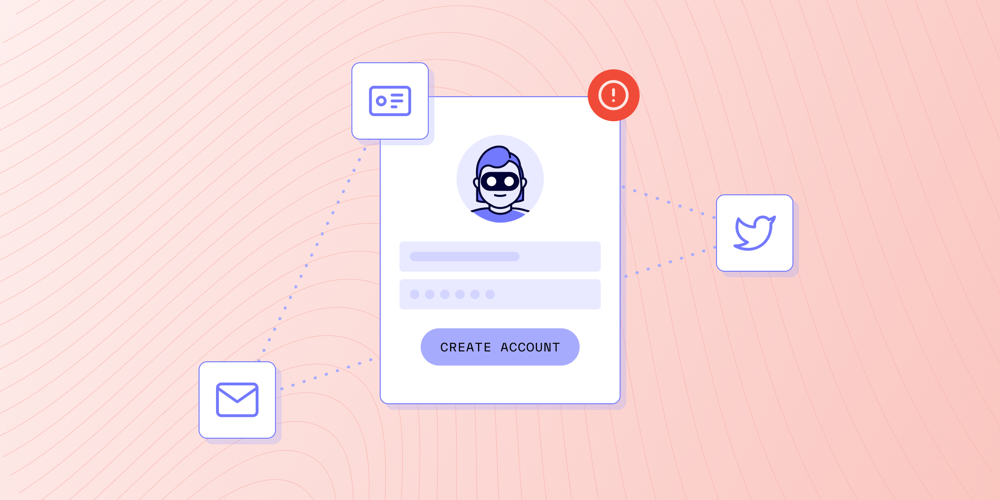

# What is account creation fraud?

Published October 24, 2022

Last updated January 12, 2026

# What is account creation fraud?

Learn what account creation fraud is, what it can look like, how it typically works, and how to protect your business and legitimate users.

Tim Stobierski

12 mins

Key takeaways

Account creation fraud usually falls into one of three buckets: a legitimate user opening duplicate accounts, a bad actor leveraging bots, or online impersonation using stolen information

Ways to prevent account creation fraud include performing identity verification, linkage analysis, and reverification
