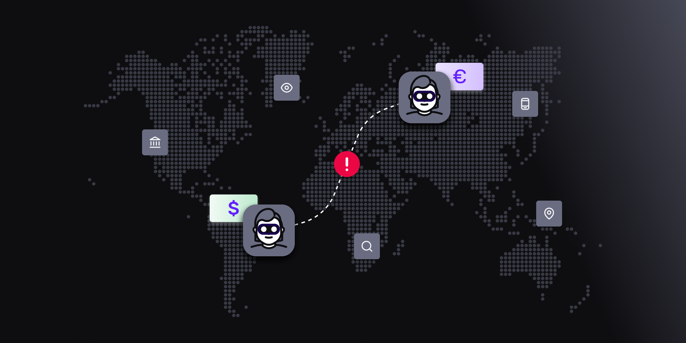

# What is Combating the Financing of Terrorism (CFT)?

Published October 24, 2022

Last updated January 12, 2026

# What is Combating the Financing of Terrorism (CFT)?

By implementing procedures to combat the financing of terrorism, you can protect customers and help make the world a safer place.

Doug Bonderud

5 mins

Key takeaways

CFT is a set of laws and regulations that aims to restrict terrorist organizations from accessing and using funds.

Benefits of CFT include restricting terrorists’ access to funds, helping law officials identify and trace terrorist networks, enhancing the stability of our global economic systems, and minimizing terrorism’s impact.

With CFT, you take KYC verification a step further by also assessing the source and use of funds.

CFT regulations primarily apply to financial institutions, but any and all businesses can benefit from appropriate AML and CFT measures — they’re an excellent way to protect your business and customers.
