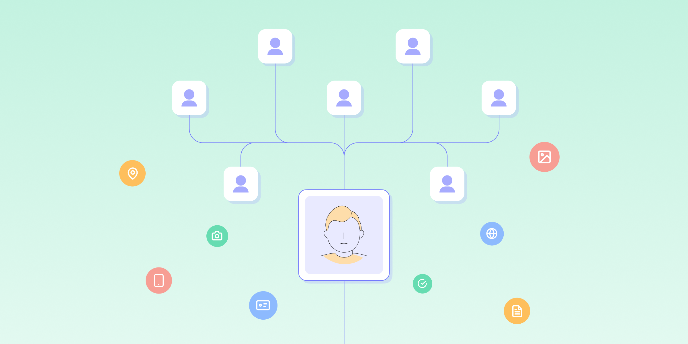

# What is Know Your Customer’s Customer (KYCC)?

Published November 22, 2022

Last updated January 12, 2026

# What is Know Your Customer’s Customer (KYCC)?

KYCC is a powerful way to protect your reputation and guard against financial crimes.

Jeff Sakasegawa

5 mins

Key takeaways

With KYCC, you don’t only assess your business clients. Rather, you look beyond to see who they do business with — particularly their customers and business partners.

As lawmakers continue to recognize the importance of KYCC, it’s expected that more regulations will be announced. By proactively implementing KYCC procedures, you’ll reduce the risk to your business and won’t have to rush to put compliance measures in place when the time comes.
