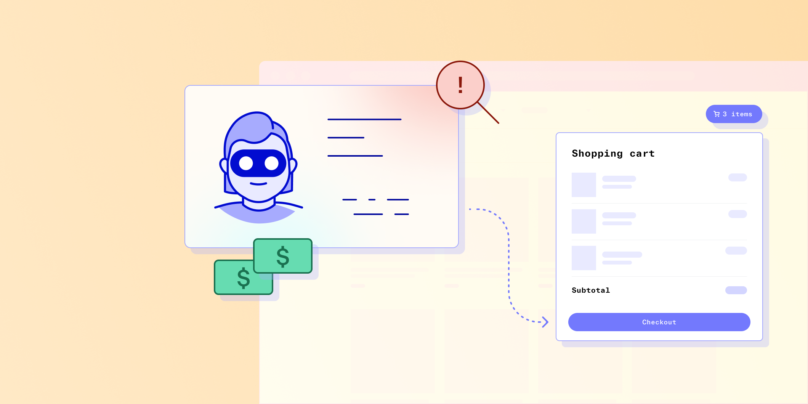

# Marketplace fraud prevention: how to fine-tune your current system

Published October 24, 2022

Last updated January 12, 2026

# Marketplace fraud prevention: how to fine-tune your current system

Learn how to mitigate marketplace fraud in your business.

Jeff Sakasegawa

10 mins

Key takeaways

Your fraud prevention program cannot manage fraud with defenses that only look at one side of the marketplace. You need a robust program that looks at both. 

An advanced, configurable platform can help you prevent fraud with a multimodal approach to detection, deterrence, and denial of service or entry.

nWay was able to uncover fraud rings they weren’t aware of by assessing both active and passive signals with Graph, Persona’s link analysis tool.
