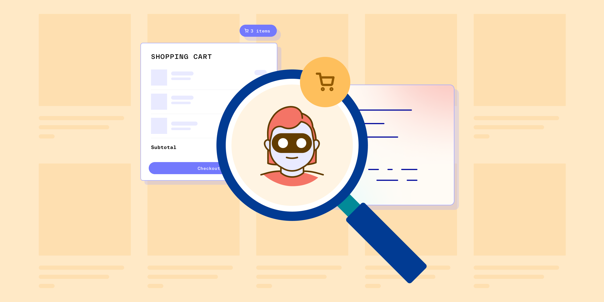

# What is the INFORM Consumers Act?

Published December 15, 2022

Last updated January 12, 2026

# What is the INFORM Consumers Act?

The INFORM Consumers Act is a law aimed at restricting online shopping fraud, while the SHOP Safe Act is a bill with the same goal. Learn more.

Jeff Sakasegawa

7 mins

Key takeaways

The INFORM Consumers Act is a law that requires online marketplaces to collect certain information about sellers earning a certain level of revenue to make it easier for regulators and investigators to investigate suspected fraud.

The SHOP Safe Act is a piece of proposed legislation that would make online marketplaces liable for copyright and trademark infringement in cases where a third party uses their platform to sell counterfeit goods with the potential to harm the health or safety of the customer, such as cosmetics, supplements, and pharmaceuticals.
