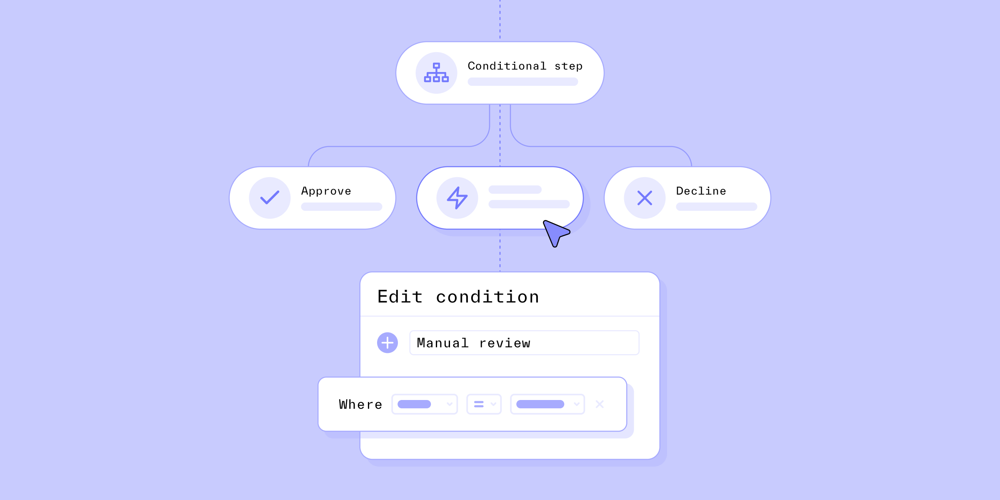

# Why your business needs flexible identity infrastructure

Published January 11, 2023

Last updated January 12, 2026

# Why your business needs flexible identity infrastructure

Identity verification isn’t one-size-fits-all. Learn how a flexible identity infrastructure can help your business be more resilient.

Daniel Lee

8 mins

Key takeaways

Your IDV needs can vary significantly depending on your business model, risks associated with your customers and the actions they take, and stakeholders.

A flexible identity verification solution empowers you to build the IDV process that best accounts for these factors while addressing your business’s unique challenges, goals, and needs.
