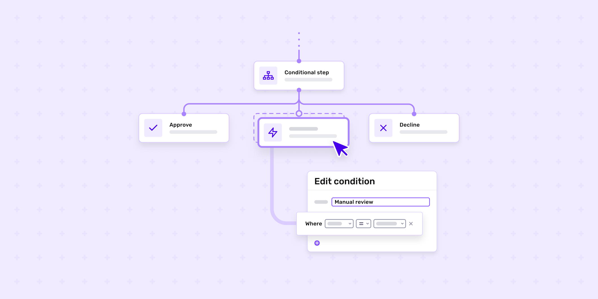

# Introducing Workflows: automations for any use case

Published October 24, 2022

Last updated January 21, 2026

# Introducing Workflows: automations for any use case

From setting custom rules to triggering actions, Workflows is a flexible, intuitive, and powerful way to automate your identity processes and more.

Ross Freiman-Mendel

4 mins

