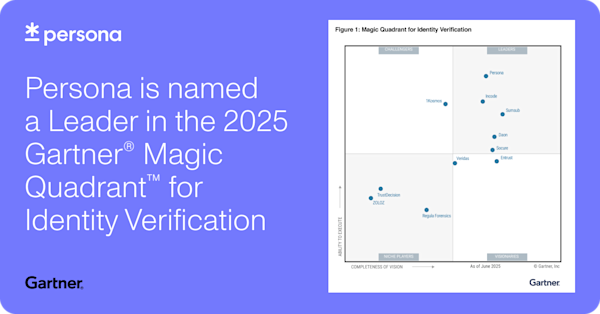
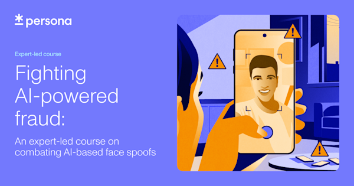
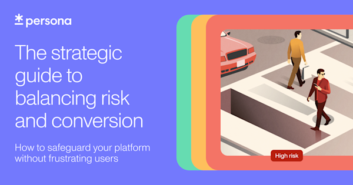

# Orchestrate and automate identity across the entire life cycle

Persona named a Leader in the 2025 Gartner® Magic Quadrant™ for Identity Verification

See why we’re positioned highest for Ability to Execute and why we’re ranked 1st across five evaluated Use Cases (Risk Mitigation, Consumer, Accessibility, Data Control, and Automation) in the Critical Capabilities report.

[Download the reports](./gartner-magic-quadrant.md) 

Persona named a Leader in The Forrester Wave™: Identity Verification Solutions, Q3 2025

See why we received the top score in both the current offering and strategy categories.

[Access the report](./forrester-wave-identity-verification-solution-report.md) 

Adapt your identity operations to every

regulation

Stay ahead of evolving threats and regulatory changes with a configurable identity platform that adapts to your business needs — from identity verification to KYC/AML, KYB, age assurance or any other use case.

Trusted by startups and the world’s largest companies

Solve today’s identity challenges — and those still to come

Use our configurable platform to design identity processes that meet all of your business goals — no compromises needed.

Maximize conversion as you scale

Adapt your identity flows without sacrificing conversion, whether you’re looking to expand to new markets, integrate new verification technology, or comply with new regulations.

Evolve at the speed of fraud

Stay ahead of emerging fraud techniques, like generative AI, with a constantly innovating platform powered by the latest in fraud detection.

Unify your identity processes

Consolidate and manage all your identity data and operations in one platform without adding operational burden — even as you add more data, create new processes, and expand your team.

Granularly control and securely manage PII

Control every aspect of how user PII is processed, stored, retained, and accessed to comply with regional regulations.

Scale faster with modular building blocks

# Orchestrate and automate identity across the entire life cycle

## Collect

Understand user risk better by dynamically collecting a wide variety of passive, active, and behavioral signals while providing legitimate users best-in-class experiences and deterring fraudsters.

## Verify and enrich

Configure our extensive library of global verification methods and risk signals to verify any individual or business. _You_ control enrichment logic and verification decisions — not a black box.

## Understand and investigate

Easily spot connections between users to proactively discover and block fraud rings, and streamline investigations with a hyper-customizable manual review hub.

## Consolidate and streamline

Centralize your identity data effortlessly within Persona, your source of truth and control center for automating processes and managing everything identity-related.

## A solution for every scenario

Design your ideal end-to-end identity flow to convert more users, streamline operations, and combat fraud.

Fraud prevention

Deter, detect, and deny fraudsters with a proactive, multi-layered approach.

[Learn more](./use-case/fraud.md)

Manual review

Expedite and conduct more thorough manual review investigations with a customizable identity hub.

[Learn more](./use-case/manual-review.md)

Trust & safety

Gain and keep user trust with a more human identity verification experience.

[Learn more](./use-case/trust.md)

KYC/AML compliance

Meet shifting compliance requirements without sacrificing conversion.

[Learn more](./use-case/compliance/kyc-aml.md)

Know Your Business (KYB)

Onboard businesses faster with automated, integrated KYB-KYC.

[Learn more](./solutions/know-your-business.md)

Age assurance

Minimize friction while staying on top of shifting age verification and privacy regulations.

[Learn more](./use-case/compliance/age-verification.md)

Reverification

Automatically reverify users at any point in their life cycle.

[Learn more](./use-case/reverification.md)

From deepfakes to synthetic faces: detect more AI-based face spoofs

Learn about the powerful enhancements we’ve rolled out behind the scenes to help businesses detect more AI-based face spoofs.

[Learn more](./blog/detect-more-ai-based-face-spoofs-persona.md)

## Security and privacy at our core

Trust is built on security and privacy. That’s why Persona adheres to the highest industry standards, maintaining compliance and certifications to safeguard you and your customers.

[Learn more](./security.md)

Scale where you want, how you want

150+

countries and territories

1+

localized languages

With worldwide coverage, Persona sets the global standard for online identity verification.

Verify your identity Verifica tu identidad Vérifiez votre identité Überprüfen Sie Ihre Identität Verifica la tua identità Verifique sua identidade Verifieer je identiteit Подтвердите вашу личность 验证您的身份 あなたの身分を確認してください تحقق من هويتك

Verify your identity Verifica tu identidad Vérifiez votre identité Überprüfen Sie Ihre Identität Verifica la tua identità Verifique sua identidade Verifieer je identiteit Подтвердите вашу личность 验证您的身份 あなたの身分を確認してください تحقق من هويتك

## See how we help businesses tackle identity’s most complex challenges

[

## OpenAI screens millions of users each month with zero friction

Read more

](https://withpersona.com/customers/openai)[

## Coursera scales its global user base and ensures strong academic integrity

Read more

](https://withpersona.com/customers/coursera)[

## Square Capital automatically verifies PPP loans

Read more

](https://withpersona.com/customers/square)[

## Lime deploys custom age assurance flows to meet international regulations

Read more

](https://withpersona.com/customers/lime)

## Stay informed with the latest from Persona

-   [
    
    
    
    ## Persona named a Leader in the 2025 Gartner® Magic Quadrant™ for Identity Verification
    
    Blog·4 min
    
    
    
    ](/blog/2025-gartner-magic-quadrant-identity-verification)

-   [
    
    
    
    ## Fighting AI-powered fraud: An expert-led course on combating AI-based face spoofs
    
    Course·4 week course
    
    
    
    ](/guides/deepfake-face-spoofs-fraud-protection-course)

-   [
    
    
    
    ## The strategic guide to balancing risk and conversion
    
    Ebook·12 min
    
    
    
    ](/guides/the-strategic-guide-to-identity-verification)
